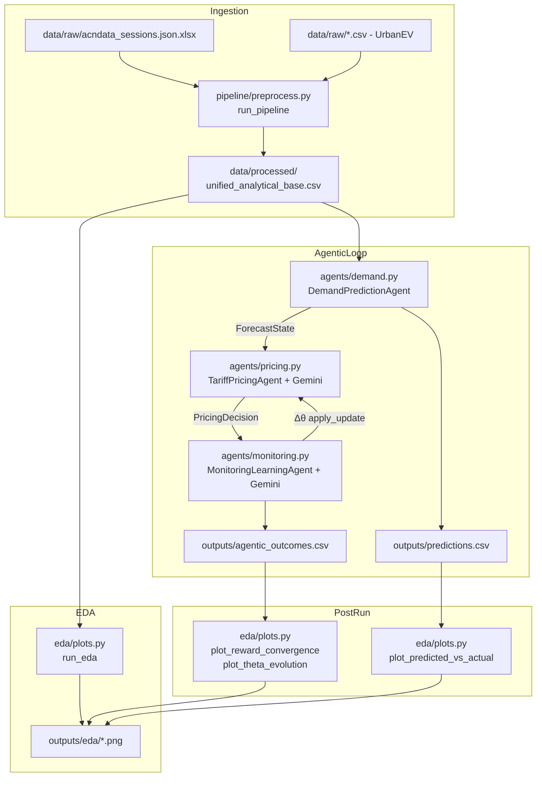

# Design Document: EV Charging Analytics & Tariff Optimisation (OP'26)

## Overview

This document describes the redesigned architecture for the OP'26 Agentic EV Charging Analytics and Dynamic Tariff Optimisation system. The existing codebase is functional but monolithic — all logic lives in four flat files (`agents.py`, `config.py`, `orchestrator.py`, `eda_op26.py`) with data files co-located in `src/`. The redesign separates concerns into a proper package hierarchy, fixes known data-quality issues in the preprocessing pipeline, adds LightGBM comparison support, and introduces post-run analysis plots and sensitivity reporting.

The system ingests two real-world datasets (ACN-Data: 30,000+ Caltech/JPL sessions; UrbanEV ST-EVCDP: 24,798 charging piles) and runs a closed three-agent feedback loop:

1. **DemandPredictionAgent** — XGBoost (+ optional LightGBM) tabular forecaster
2. **TariffPricingAgent** — Gemini-powered continuous tariff reasoner
3. **MonitoringLearningAgent** — Gemini-powered reflective evaluator that updates the parameter vector Θ = [ε, α, β]

---

## Architecture

### Target Repository Layout

```
ev-charging-analytics-optimization/
├── data/
│   ├── raw/
│   │   ├── acndata_sessions.json.xlsx
│   │   ├── volume.csv
│   │   ├── occupancy.csv
│   │   ├── duration.csv
│   │   ├── price.csv
│   │   ├── stations.csv
│   │   ├── adj.csv
│   │   ├── distance.csv
│   │   ├── time.csv
│   │   └── information.csv
│   └── processed/
│       └── unified_analytical_base.csv
├── outputs/
│   ├── eda/
│   ├── agentic_outcomes.csv
│   ├── predictions.csv
│   ├── model_comparison.csv
│   └── sensitivity_analysis.csv
├── src/
│   ├── __init__.py
│   ├── config.py                  ← centralised constants, schemas, Gemini factory
│   ├── pipeline/
│   │   ├── __init__.py
│   │   └── preprocess.py          ← ACN + UrbanEV ingestion → unified_analytical_base.csv
│   ├── eda/
│   │   ├── __init__.py
│   │   └── plots.py               ← all EDA visualisation functions
│   ├── agents/
│   │   ├── __init__.py
│   │   ├── demand.py              ← DemandPredictionAgent
│   │   ├── pricing.py             ← TariffPricingAgent
│   │   └── monitoring.py          ← MonitoringLearningAgent
│   └── utils/
│       ├── __init__.py
│       └── logging_utils.py       ← version logging, structured log helpers
├── orchestrator.py                ← CLI entry point, AgenticOrchestrator
├── requirements.txt
└── README.md
```

### Data Flow



---

## Components and Interfaces

### `src/config.py`

Central source of truth for all constants, Pydantic schemas, the Gemini factory, and the shared `engineer_features()` function. No other module defines pricing constants or schemas.

```python
# Pricing constants
P_BASE: float = 15.0
P_SURGE_CAP: float = 22.0
P_DISCOUNT_FLOOR: float = 10.0
SURGE_THRESHOLD: float = 0.80
DISCOUNT_THRESHOLD: float = 0.30
RANDOM_STATE: int = 42
TRAIN_RATIO: float = 0.80

# Model hyperparameters
XGB_PARAMS: dict  # n_estimators, learning_rate, max_depth, subsample, ...
LGB_PARAMS: dict  # equivalent LightGBM hyperparameters

# File paths (relative to project root)
RAW_ACN_PATH: str = "data/raw/acndata_sessions.json.xlsx"
RAW_URBAN_DIR: str = "data/raw"
PROCESSED_BASE_PATH: str = "data/processed/unified_analytical_base.csv"
OUTPUTS_DIR: str = "outputs"
EDA_OUTPUTS_DIR: str = "outputs/eda"

# Gemini
GEMINI_MODEL: str = "gemini-2.0-flash"

def build_gemini_model(system_instruction: str, temperature: float = 0.2) -> genai.GenerativeModel:
    """Reads GEMINI_API_KEY from env; raises EnvironmentError with export hint if missing."""

def engineer_features(df: pd.DataFrame) -> pd.DataFrame:
    """Causal lag/rolling feature engineering. Single source of truth used by
    both DemandPredictionAgent and EDA feature importance plot."""

FEATURE_COLS: list[str]  # 22-element list of engineered feature names

# Pydantic schemas (see Data Models section)
class ForecastState(BaseModel): ...
class PricingDecision(BaseModel): ...
class LearningUpdate(BaseModel): ...
```

### `src/pipeline/preprocess.py`

```python
def run_pipeline(
    acn_path: str = RAW_ACN_PATH,
    urban_dir: str = RAW_URBAN_DIR,
    output_path: str = PROCESSED_BASE_PATH,
) -> pd.DataFrame:
    """
    Full preprocessing pipeline. Callable as a function (not just __main__).
    Raises FileNotFoundError with descriptive message if any input is missing.
    Logs row counts at each stage.
    Returns the unified analytical base DataFrame and writes it to output_path.
    """

def _load_acn(path: str) -> pd.DataFrame:
    """Load ACN Excel, parse timestamps, exclude zero/null kWh rows (logged)."""

def _load_urban(urban_dir: str) -> pd.DataFrame:
    """Melt volume/occupancy/duration wide matrices; validate merge nulls."""

def _aggregate_acn_hourly(df: pd.DataFrame) -> pd.DataFrame:
    """Group by hourly_timestamp → acn_sessions_count, acn_total_kwh, acn_base_revenue."""

def _aggregate_urban_hourly(df: pd.DataFrame) -> pd.DataFrame:
    """Group by time_step → urban_mean_utilization, urban_peak_queue, urban_total_volume."""

def _align_and_merge(acn_hourly: pd.DataFrame, urban_hourly: pd.DataFrame) -> pd.DataFrame:
    """
    Align ACN and UrbanEV hourly aggregates by positional index (existing approach),
    add hour_of_day, day_of_week, is_weekend columns.
    Logs source row counts and final merged row count.
    """
```

### `src/eda/plots.py`

```python
def run_eda(base_path: str, acn_path: str, output_dir: str) -> None:
    """Entry point: loads data, calls all plot functions, saves to output_dir."""

# Individual plot functions (each saves one PNG):
def plot_demand_trend(df: pd.DataFrame, output_dir: str) -> None: ...
def plot_intraday_cycle(df: pd.DataFrame, output_dir: str) -> None: ...
def plot_weekday_weekend(df: pd.DataFrame, output_dir: str) -> None: ...
def plot_acn_distributions(acn: pd.DataFrame, output_dir: str) -> None: ...
def plot_peak_volatility(df: pd.DataFrame, output_dir: str) -> None: ...
def plot_correlation_heatmap(df: pd.DataFrame, output_dir: str) -> None: ...
def plot_revenue_analysis(df: pd.DataFrame, acn: pd.DataFrame, output_dir: str) -> None: ...
def plot_acn_session_efficiency(acn: pd.DataFrame, output_dir: str) -> None: ...
def plot_tariff_narrative(df: pd.DataFrame, output_dir: str) -> None: ...
def plot_feature_importance(df: pd.DataFrame, output_dir: str) -> None:
    """Skips gracefully (logs warning) if xgboost is unavailable."""

# Post-run plots (require outputs from orchestrator):
def plot_predicted_vs_actual(predictions_path: str, output_dir: str) -> None:
    """Reads outputs/predictions.csv; marks train/test split boundary."""

def plot_reward_convergence(outcomes_path: str, output_dir: str) -> None:
    """Reads outputs/agentic_outcomes.csv; plots per-step reward + 50-step rolling mean."""

def plot_theta_evolution(outcomes_path: str, output_dir: str) -> None:
    """Reads outputs/agentic_outcomes.csv; plots ε, α, β on a single figure."""
```

### `src/agents/demand.py`

```python
class DemandPredictionAgent:
    def __init__(
        self,
        csv_path: str = PROCESSED_BASE_PATH,
        use_lightgbm: bool = False,
    ) -> None: ...

    def predict_state(self, row_idx: int) -> ForecastState:
        """Returns validated ForecastState; u_pred clipped [0,1], kwh_delivered ≥ 0.01."""

    def evaluation_metrics(self) -> dict[str, dict[str, float]]:
        """Returns {target: {RMSE, MAE, R2}} for both output targets."""

    def compare_backends(self) -> pd.DataFrame:
        """
        Only available when use_lightgbm=True.
        Returns a DataFrame with RMSE/MAE/R² for XGBoost and LightGBM side-by-side.
        Exported to outputs/model_comparison.csv by the orchestrator.
        """

    def __len__(self) -> int:
        """Returns len(test_df)."""
```

### `src/agents/pricing.py`

```python
class TariffPricingAgent:
    _THETA_BOUNDS = {"epsilon": (0.1, 5.0), "alpha": (1.0, 10.0), "beta": (1.0, 10.0)}

    def __init__(
        self,
        epsilon_init: float = 1.2,
        alpha_init: float = 4.0,
        beta_init: float = 4.0,
        max_retries: int = 3,
    ) -> None: ...

    def compute_tariff(self, state: ForecastState) -> PricingDecision:
        """Calls Gemini; falls back to deterministic sigmoid after max_retries failures."""

    def apply_update(self, delta: np.ndarray) -> None:
        """Adds delta to theta; clips each parameter to its defined bounds."""

    def run_sensitivity_analysis(
        self, test_df: pd.DataFrame, epsilon_values: list[float]
    ) -> pd.DataFrame:
        """
        Runs deterministic fallback with each ε value; returns revenue gain distribution.
        Exported to outputs/sensitivity_analysis.csv by the orchestrator.
        """

    @property
    def epsilon(self) -> float: ...
    @property
    def alpha(self) -> float: ...
    @property
    def beta(self) -> float: ...
```

### `src/agents/monitoring.py`

```python
class MonitoringLearningAgent:
    def __init__(
        self,
        pricing_agent: TariffPricingAgent,
        lr: float = 0.8,
        lr_decay: float = 0.002,
        max_retries: int = 3,
    ) -> None: ...

    def step(self, state: ForecastState, decision: PricingDecision) -> LearningUpdate:
        """
        Calls Gemini for metric computation + Δθ proposal.
        Scales Δθ by η = η₀ / (1 + decay × t) before apply_update().
        Appends to episode_log.
        """

    def summary(self) -> pd.DataFrame:
        """Returns DataFrame with one row per episode step, all metric columns."""

    def off_peak_uplift(self, baseline_df: pd.DataFrame) -> float:
        """
        Computes Off_Peak_Uplift: % change in mean session count during
        discount-regime hours vs pre-optimisation baseline.
        """
```

### `src/utils/logging_utils.py`

```python
def log_dependency_versions() -> None:
    """Logs pandas, numpy, xgboost, sklearn versions at INFO level."""

def configure_logging(level: str = "INFO") -> None:
    """Sets up root logger with timestamp format."""
```

### `orchestrator.py` (top-level CLI)

```python
class AgenticOrchestrator:
    def __init__(self, csv_path, epsilon_init, alpha_init, beta_init,
                 lr, lr_decay, api_delay, use_lightgbm) -> None:
        """Validates csv_path exists and GEMINI_API_KEY is set before constructing agents."""

    def run(self, max_steps: int | None, verbose_every: int) -> pd.DataFrame: ...
    def export(self, path: str) -> None: ...
    def export_predictions(self, path: str) -> None: ...
    def export_model_comparison(self, path: str) -> None: ...
    def export_sensitivity_analysis(self, path: str) -> None: ...
    def _print_final_report(self, df: pd.DataFrame) -> None: ...

def parse_args() -> argparse.Namespace:
    """Parses all CLI args: --csv, --steps, --verbose, --lr, --decay,
    --delay, --epsilon, --alpha, --beta, --out, --predictions, --log-level,
    --lightgbm."""

def main() -> None: ...
```

---

## Data Models

### Pydantic Schemas (`src/config.py`)

```python
class ForecastState(BaseModel):
    """Output of DemandPredictionAgent → input to TariffPricingAgent."""
    timestamp:     str
    u_pred:        float = Field(..., ge=0.0, le=1.0)   # clipped by validator
    q_pred:        float = Field(..., ge=0.0)
    u_actual:      float = Field(..., ge=0.0, le=1.0)
    q_actual:      float = Field(..., ge=0.0)
    kwh_delivered: float = Field(..., gt=0.0)            # floored at 0.01
    hour_of_day:   int   = Field(..., ge=0, le=23)
    is_weekend:    int   = Field(..., ge=0, le=1)

    @field_validator("u_pred", "u_actual", mode="before")
    @classmethod
    def clip_utilisation(cls, v: float) -> float:
        return float(np.clip(v, 0.0, 1.0))


class PricingDecision(BaseModel):
    """JSON schema Gemini TariffPricingAgent must return."""
    p_new:           float = Field(..., ge=P_DISCOUNT_FLOOR, le=P_SURGE_CAP)
    regime:          Literal["surge", "discount", "neutral"]
    surge_scalar:    float = Field(..., ge=0.0, le=1.0)
    discount_scalar: float = Field(..., ge=0.0, le=1.0)
    elasticity_used: float = Field(..., gt=0.0)
    rationale:       str

    @field_validator("p_new", mode="before")
    @classmethod
    def clip_price(cls, v: float) -> float:
        return float(np.clip(v, P_DISCOUNT_FLOOR, P_SURGE_CAP))


class LearningUpdate(BaseModel):
    """JSON schema Gemini MonitoringLearningAgent must return."""
    delta_epsilon:       float   # |Δε| ≤ 0.05
    delta_alpha:         float   # |Δα| ≤ 0.10
    delta_beta:          float   # |Δβ| ≤ 0.10
    reward:              float
    revenue_gain_pct:    float
    charger_utilisation: float
    avg_wait_reduction:  float
    pricing_efficiency:  float   # ₹ per kWh delivered
    demand_shift:        float
    reflection:          str
```

### Output File Schemas

**`data/processed/unified_analytical_base.csv`**

| Column | Type | Description |
|---|---|---|
| `hourly_timestamp` | datetime | ACN session connection hour (rounded) |
| `acn_sessions_count` | int | Sessions in that hour |
| `acn_total_kwh` | float | Total kWh delivered (zero-kWh rows excluded) |
| `acn_base_revenue` | float | `acn_total_kwh × ₹15` |
| `urban_mean_utilization` | float | Mean charger utilisation across nodes [0,1] |
| `urban_peak_queue` | float | Max queue length proxy across nodes |
| `urban_total_volume` | float | Sum of traffic volume across nodes |
| `hour_of_day` | int | 0–23 |
| `day_of_week` | int | 0=Mon … 6=Sun |
| `is_weekend` | int | 1 if Sat/Sun |

**`outputs/agentic_outcomes.csv`**

| Column | Type | Description |
|---|---|---|
| `step` | int | Episode step index |
| `timestamp` | str | Hourly timestamp from ForecastState |
| `u_pred` | float | Predicted utilisation |
| `q_pred` | float | Predicted queue proxy |
| `u_actual` | float | Actual utilisation |
| `q_actual` | float | Actual queue proxy |
| `p_new` | float | Optimised tariff ₹/kWh |
| `regime` | str | surge / discount / neutral |
| `rationale` | str | Gemini pricing rationale |
| `revenue_new` | float | Demand-adjusted revenue |
| `revenue_baseline` | float | `P_BASE × kwh` |
| `revenue_gain_pct` | float | `(revenue_new − baseline) / baseline × 100` |
| `charger_utilisation` | float | Adjusted utilisation after demand shift |
| `avg_wait_reduction` | float | Queue improvement |
| `pricing_efficiency` | float | ₹ per kWh |
| `demand_shift` | float | `−ε × ((p_new − 15) / 15)` |
| `reward` | float | Scalar reward |
| `epsilon_after` | float | ε after this step's update |
| `alpha_after` | float | α after this step's update |
| `beta_after` | float | β after this step's update |
| `reflection` | str | Gemini learning reflection |
| `lr_used` | float | Learning rate η applied this step |

**`outputs/predictions.csv`**

| Column | Type | Description |
|---|---|---|
| `hourly_timestamp` | str | Timestamp |
| `hour_of_day` | int | 0–23 |
| `is_weekend` | int | 0/1 |
| `actual_urban_mean_utilization` | float | Ground truth |
| `actual_urban_peak_queue` | float | Ground truth |
| `pred_urban_mean_utilization` | float | XGBoost prediction |
| `pred_urban_peak_queue` | float | XGBoost prediction |

**`outputs/model_comparison.csv`** (when LightGBM enabled)

| Column | Type | Description |
|---|---|---|
| `target` | str | `urban_mean_utilization` or `urban_peak_queue` |
| `xgb_rmse` | float | XGBoost RMSE |
| `xgb_mae` | float | XGBoost MAE |
| `xgb_r2` | float | XGBoost R² |
| `lgb_rmse` | float | LightGBM RMSE |
| `lgb_mae` | float | LightGBM MAE |
| `lgb_r2` | float | LightGBM R² |

**`outputs/sensitivity_analysis.csv`**

| Column | Type | Description |
|---|---|---|
| `epsilon` | float | ε value tested |
| `mean_revenue_gain_pct` | float | Mean revenue gain across test set |
| `std_revenue_gain_pct` | float | Std dev of revenue gain |
| `min_revenue_gain_pct` | float | Min revenue gain |
| `max_revenue_gain_pct` | float | Max revenue gain |

### Three-Agent Feedback Loop Design

The loop is intentionally **synchronous and sequential** to preserve causal ordering — each step's Θ update must be visible to the next Gemini pricing call.

```
for i in range(steps):
    state    = demand_agent.predict_state(i)          # deterministic XGBoost
    decision = pricing_agent.compute_tariff(state)    # Gemini call 1
    update   = monitor_agent.step(state, decision)    # Gemini call 2 → Δθ
    # Δθ is scaled by η and applied inside monitor_agent.step()
    time.sleep(api_delay)                             # rate-limit guard
```

Θ update formula:
```
η_t = η₀ / (1 + decay × t)
Δθ_scaled = [Δε × η_t, Δα × η_t, Δβ × η_t]
θ_new = clip(θ + Δθ_scaled, bounds)
```

Bounds: ε ∈ [0.1, 5.0], α ∈ [1.0, 10.0], β ∈ [1.0, 10.0]

Revenue formula (consistent across MonitoringLearningAgent and episode log):
```
demand_shift = −ε × ((p_new − 15) / 15)
revenue_new  = p_new × kwh × max(0.05, 1 + demand_shift)
```

---

## Correctness Properties

*A property is a characteristic or behavior that should hold true across all valid executions of a system — essentially, a formal statement about what the system should do. Properties serve as the bridge between human-readable specifications and machine-verifiable correctness guarantees.*

### Property 1: Zero-kWh rows are excluded from pipeline output

*For any* ACN input DataFrame containing rows where `kWhDelivered` is zero or null, the resulting unified analytical base must contain no rows derived from those sessions — i.e., the aggregated `acn_total_kwh` for any hour must equal the sum of only the non-zero, non-null kWh values from that hour.

**Validates: Requirements 2.2**

---

### Property 2: Melted UrbanEV merge produces no nulls in key columns

*For any* valid wide-format volume, occupancy, and duration matrices, after melting to long format and merging on `[time_step, station_node]`, the resulting DataFrame must have zero null values in `traffic_volume`, `occupancy_density`, and `avg_duration`.

**Validates: Requirements 2.3**

---

### Property 3: Charger utilisation rate is always in [0, 1]

*For any* `occupancy_density` value (including values > 1/1.2 that would overflow before clipping), the engineered `charger_utilization` feature computed as `occupancy_density × 1.2` clipped to `[0, 1]` must always lie within `[0.0, 1.0]`.

**Validates: Requirements 2.4**

---

### Property 4: Missing input file raises FileNotFoundError

*For any* file path argument passed to `run_pipeline()` that does not exist on disk, the function must raise a `FileNotFoundError` containing the missing path string before performing any data processing.

**Validates: Requirements 2.7**

---

### Property 5: Train/test split is strictly chronological

*For any* unified analytical base DataFrame, after the 80/20 chronological split performed by `DemandPredictionAgent`, every timestamp in the test set must be strictly greater than every timestamp in the training set — i.e., `max(train_timestamps) < min(test_timestamps)`.

**Validates: Requirements 4.1**

---

### Property 6: Lag features are causally correct

*For any* engineered DataFrame produced by `engineer_features()`, the value of `util_lag1` at row index `i` must equal the value of `urban_mean_utilization` at row index `i − 1` (before `dropna`). No lag feature at row `i` may reference data from row `i` or later.

**Validates: Requirements 4.2**

---

### Property 7: ForecastState output satisfies schema bounds

*For any* valid `row_idx` in the test set, `predict_state(row_idx)` must return a `ForecastState` where `u_pred ∈ [0.0, 1.0]` and `kwh_delivered ≥ 0.01`, regardless of the raw values in the underlying data row.

**Validates: Requirements 4.4**

---

### Property 8: Pricing regime and price bounds are consistent

*For any* `ForecastState`, the `PricingDecision` returned by `compute_tariff()` (including the deterministic fallback) must satisfy all of the following simultaneously:
- `p_new ∈ [10.0, 22.0]` always
- If `u_pred > 0.80` → `regime == "surge"` and `p_new > 15.0`
- If `u_pred < 0.30` → `regime == "discount"` and `p_new < 15.0`
- If `0.30 ≤ u_pred ≤ 0.80` → `regime == "neutral"`

**Validates: Requirements 5.1, 5.2, 5.3, 5.6**

---

### Property 9: Theta parameters remain within bounds after any update

*For any* delta vector `[Δε, Δα, Δβ]` passed to `apply_update()`, the resulting theta must satisfy `ε ∈ [0.1, 5.0]`, `α ∈ [1.0, 10.0]`, and `β ∈ [1.0, 10.0]`, regardless of the magnitude or sign of the delta.

**Validates: Requirements 5.5**

---

### Property 10: Revenue formula is applied consistently

*For any* `p_new`, `kwh_delivered`, and `epsilon` values, the `revenue_new` computed by `MonitoringLearningAgent` must equal `p_new × kwh × max(0.05, 1 + (−ε × ((p_new − 15) / 15)))`. This formula must produce identical results whether computed inside `step()` or in the episode log.

**Validates: Requirements 6.2**

---

### Property 11: Learning rate schedule decays monotonically

*For any* initial learning rate `η₀ > 0` and decay coefficient `decay > 0`, the effective learning rate at step `t` must equal `η₀ / (1 + decay × t)`, and this value must be strictly decreasing as `t` increases.

**Validates: Requirements 6.3**

---

### Property 12: Off_Peak_Uplift formula is correct

*For any* set of per-hour session counts (post-optimisation and baseline), the `off_peak_uplift()` method must return `(mean_post − mean_baseline) / mean_baseline × 100`, where both means are computed only over hours classified as discount-regime hours.

**Validates: Requirements 6.6, 8.4**

---

### Property 13: Episode step count invariant

*For any* number of steps `N` run through the orchestrator loop, the `summary()` DataFrame returned by `MonitoringLearningAgent` must have exactly `N` rows, and the exported `agentic_outcomes.csv` must also have exactly `N` data rows (excluding the header).

**Validates: Requirements 7.1, 7.4**

---

### Property 14: Pipeline is deterministic (idempotent on same inputs)

*For any* fixed set of input files, running `run_pipeline()` twice must produce output DataFrames with identical row counts, column names, and values — i.e., `df1.equals(df2)` must be true.

**Validates: Requirements 10.2**

---

### Property 15: Pydantic schemas enforce field bounds

*For any* value outside the declared field bounds (e.g., `u_pred > 1.0`, `p_new > 22.0`, `p_new < 10.0`, `kwh_delivered ≤ 0`), constructing the corresponding Pydantic model must either raise a `ValidationError` or clip the value to the valid range via the declared validator — it must never silently accept an out-of-bounds value.

**Validates: Requirements 9.4**

---

## Error Handling

### Pipeline (`src/pipeline/preprocess.py`)

- **Missing input file**: `FileNotFoundError` raised immediately with the missing path and the pipeline step that requires it. No partial processing occurs.
- **Zero/null kWh rows**: Logged at WARNING level with count; rows excluded before aggregation. Does not raise.
- **Merge null validation**: If unexpected nulls appear after the `[time_step, station_node]` merge, a `ValueError` is raised with the null count and affected columns.
- **Empty aggregation result**: If either ACN or UrbanEV hourly aggregation produces zero rows, a `ValueError` is raised before the alignment step.

### Agents

- **Gemini API failure**: Both `TariffPricingAgent` and `MonitoringLearningAgent` retry up to `max_retries` times with exponential backoff (`1.5 × attempt` seconds). After exhausting retries, the deterministic fallback is used and an ERROR is logged. The loop never crashes.
- **Pydantic `ValidationError`**: Caught inside the Gemini response parsing block; treated as a failed attempt and retried.
- **`predict_state()` out-of-range index**: Standard `IndexError` from pandas — not caught; callers are responsible for bounds checking.

### Orchestrator

- **Missing CSV**: Checked at initialisation via `Path(csv_path).exists()`; raises `FileNotFoundError` with descriptive message before any agent is constructed.
- **Missing `GEMINI_API_KEY`**: Checked inside `build_gemini_model()`; raises `EnvironmentError` with the exact `export` command needed.
- **Output directory creation**: `outputs/` and `outputs/eda/` are created with `Path.mkdir(parents=True, exist_ok=True)` before any export.

### EDA Module

- **XGBoost unavailable**: `plot_feature_importance()` wraps the import in a `try/except ImportError`; logs a WARNING and returns without raising.
- **Missing post-run output files**: `plot_predicted_vs_actual()` and `plot_reward_convergence()` check for file existence before loading; log a WARNING and skip if absent.

---

## Testing Strategy

### Dual Testing Approach

Both unit tests and property-based tests are required. They are complementary:

- **Unit tests** verify specific examples, integration points, and error conditions
- **Property tests** verify universal invariants across randomly generated inputs

### Property-Based Testing

Use **Hypothesis** (Python) as the property-based testing library.

Each property test must run a minimum of **100 iterations** (configured via `@settings(max_examples=100)`).

Each test must be tagged with a comment referencing the design property:
```python
# Feature: ev-charging-analytics-optimization, Property N: <property_text>
```

Property test mapping:

| Property | Test Description | Hypothesis Strategy |
|---|---|---|
| P1: Zero-kWh exclusion | Generate ACN DataFrames with random zero/null kWh rows; verify excluded from output | `st.lists(st.floats(min_value=0))` with some zeros |
| P2: Merge null-free | Generate random wide matrices; verify melted merge has no nulls | `st.integers`, `st.floats` for matrix values |
| P3: Utilisation clipping | For any `occupancy_density`, verify `clip(v × 1.2, 0, 1) ∈ [0,1]` | `st.floats(allow_nan=False)` |
| P4: Missing file error | For any non-existent path string, verify `FileNotFoundError` | `st.text()` filtered to non-existent paths |
| P5: Chronological split | For any sorted timestamp series, verify split boundary | `st.lists(st.datetimes())` sorted |
| P6: Causal lag features | For any DataFrame, verify `util_lag1[i] == urban_mean_utilization[i-1]` | `st.lists(st.floats())` |
| P7: ForecastState bounds | For any row with extreme raw values, verify `u_pred ∈ [0,1]`, `kwh ≥ 0.01` | `st.floats` for raw values |
| P8: Pricing regime/bounds | For any `u_pred`, verify regime and price bounds from fallback | `st.floats(min_value=0, max_value=1)` |
| P9: Theta bounds | For any delta vector, verify theta stays in bounds | `st.floats` for delta components |
| P10: Revenue formula | For any `p_new`, `kwh`, `epsilon`, verify formula equality | `st.floats(min_value=10, max_value=22)` etc. |
| P11: LR schedule | For any `η₀`, `decay`, `t`, verify monotonic decay | `st.floats(min_value=0.01)`, `st.integers(min_value=0)` |
| P12: Off_Peak_Uplift | For any session count arrays, verify formula | `st.lists(st.floats(min_value=0))` |
| P13: Step count invariant | For any N steps, verify summary has N rows | `st.integers(min_value=1, max_value=50)` |
| P14: Pipeline determinism | Run pipeline twice on same data; verify `df1.equals(df2)` | Fixed seed inputs |
| P15: Pydantic bounds | For any out-of-bounds value, verify ValidationError or clipping | `st.floats` outside valid ranges |

### Unit Tests

Unit tests focus on:

- **Integration**: `run_pipeline()` end-to-end with sample data files
- **EDA file output**: Verify expected PNG files are created in `outputs/eda/`
- **CLI argument parsing**: Verify all `--` arguments are accepted by `parse_args()`
- **`evaluation_metrics()` return shape**: Verify dict has both target keys with RMSE/MAE/R² sub-keys
- **LightGBM comparison**: When `use_lightgbm=True`, verify `compare_backends()` returns DataFrame with expected columns
- **Gemini fallback**: Mock Gemini to always raise; verify valid `PricingDecision` / `LearningUpdate` is returned
- **`summary()` DataFrame columns**: Verify all required columns are present after N steps
- **Output CSV schemas**: Verify column names of `agentic_outcomes.csv`, `predictions.csv`, `model_comparison.csv`, `sensitivity_analysis.csv`
- **`build_gemini_model()` without API key**: Verify `EnvironmentError` is raised
- **Orchestrator initialisation with missing CSV**: Verify `FileNotFoundError` is raised

### Test Configuration

```python
# pytest configuration (pytest.ini or pyproject.toml)
[tool.pytest.ini_options]
testpaths = ["tests"]
addopts = "--tb=short -q"

# Hypothesis settings profile
from hypothesis import settings, HealthCheck
settings.register_profile("ci", max_examples=100, suppress_health_check=[HealthCheck.too_slow])
settings.load_profile("ci")
```

### Test Directory Layout

```
tests/
├── conftest.py              ← shared fixtures (sample DataFrames, mock Gemini)
├── test_pipeline.py         ← P1, P2, P3, P4, P14 + pipeline unit tests
├── test_features.py         ← P5, P6 (feature engineering and split)
├── test_agents.py           ← P7, P8, P9, P10, P11, P13 + agent unit tests
├── test_monitoring.py       ← P12 + monitoring/learning unit tests
├── test_schemas.py          ← P15 + Pydantic schema unit tests
└── test_eda.py              ← EDA output file existence unit tests
```
